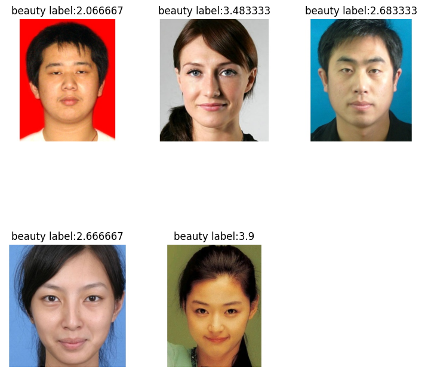

This is a CV project:

- Dataset: https://www.kaggle.com/datasets/pranavchandane/scut-fbp5500-v2-facial-beauty-scores

- I've applied Keypoint detection model from torchvision to detect keypoints, and finetuned ViT model from HuggingFace to do the facial rating.

- Hyperparameter tuning using Weight and Biases.

- Check the notebook at kaggle: https://www.kaggle.com/code/meichenliu/notebooka-face-beauty

labels and predictions:

- A glance at the photos:
  
  

- Keypoint detection model from torchvision:
  
  

- Finetuned ViT model:
  
 

  

